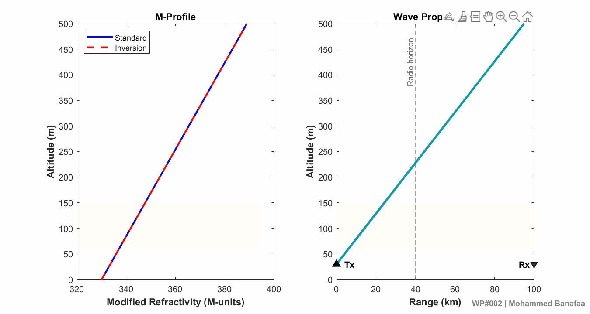

# [WP#002] The Physics of Duct Formation:
## How Weather Creates Radio Waveguides

**Wireless Propagation Visuals**

---

## Overview

Atmospheric ducts do not appear randomly.

They form when vertical variations in atmospheric temperature,
humidity, and pressure create sufficiently strong refractivity
gradients in the lower troposphere.

This post explores the physical mechanism connecting atmospheric
conditions to the formation of a radio-frequency trapping layer.

---

## Physical Principle

Atmospheric radio refractivity is calculated from:

N = 77.6/T (P + 4810e/T)

where:

- T = absolute temperature (K)
- P = atmospheric pressure (hPa)
- e = water-vapor pressure (hPa)

Modified refractivity accounts for Earth's curvature:

M = N + 0.157z

where z is altitude in metres.

A trapping layer exists when:

dM/dz <= 0

---

## Visualization

## Animation

---

## MATLAB Simulation

The MATLAB implementation is available in:

`WP002_Duct_Formation.m`

The simulation:

1. Loads atmospheric sounding data.
2. Calculates atmospheric refractivity N.
3. Calculates modified refractivity M.
4. Determines the vertical M-gradient.
5. Identifies the trapping layer.
6. Visualizes the atmospheric conditions responsible for duct formation.

---

## LinkedIn Post

[𝐖𝐏-𝟎𝟎𝟐] 𝐓𝐡𝐞 𝐏𝐡𝐲𝐬𝐢𝐜𝐬 𝐨𝐟 𝐃𝐮𝐜𝐭 𝐅𝐨𝐫𝐦𝐚𝐭𝐢𝐨𝐧: 𝐇𝐨𝐰 𝐖𝐞𝐚𝐭𝐡𝐞𝐫 𝐂𝐫𝐞𝐚𝐭𝐞𝐬 𝐑𝐚𝐝𝐢𝐨 𝐖𝐚𝐯𝐞𝐠𝐮𝐢𝐝𝐞𝐬

🌡️ A tropospheric duct doesn't form by chance; it is a direct consequence of how atmospheric temperature and humidity vary with altitude. In a standard atmosphere, refractivity smoothly decreases, bending radio rays gently toward the Earth, but not enough to trap them.

📉 Ducting occurs when a temperature inversion (warm air over cool air) coincides with a sharp drop in atmospheric moisture. To understand why, we look at the Modified Refractivity (𝑴) profile. The radio refractivity 𝑵 is defined by ITU-R P.453 as:
𝑵= (77.6 / 𝑻) × [𝑷 + 4810(𝙚 / 𝙏)]
where 𝑷 is atmospheric pressure (hPa), 𝙏 is temperature (K), and 𝙚 is water vapour pressure (hPa). Modified refractivity is then:
𝑴 = 𝑵 + 0.157𝒛
Increasing 𝙏 and decreasing 𝙚 both reduce 𝑵. If this reduction outpaces the natural +0.157𝒛 term, the result is a negative gradient (𝒅𝑴/𝒅𝒛<0), the condition for signal trapping.

🌊 Depending on where this inversion occurs, it forms one of three structures: a surface duct (inversion at ground level), an elevated duct (inversion aloft, common with subsiding air), or an evaporation duct (a shallow layer over open water).

🎥 The two Figures below, driven by real-world sounding data, directly illustrate this transition:
𝑳𝒆𝒇𝒕 𝑭𝒊𝒈𝒖𝒓𝒆 (The Cause): Shows the altitude profiles where a temperature inversion and a sharp humidity drop occur simultaneously.
𝑹𝒊𝒈𝒉𝒕 𝑭𝒊𝒈𝒖𝒓𝒆 (The Effect): Translates this weather data into the 𝑴-profile. Watch how the radio wave escapes under standard conditions but becomes tightly channelled the moment the negative gradient forms.
🧠 Understanding this 𝑴-profile behaviour is the foundation for everything that follows, from duct-aware modelling to AI-based channel prediction.

↻ 𝑵𝒆𝒙𝒕 𝒖𝒑: Duct characterization, exploring how the thickness, strength, and trapping height of these layers dictate network performance.