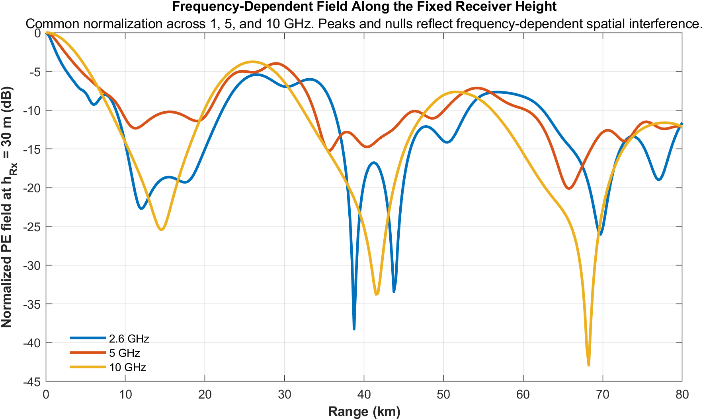
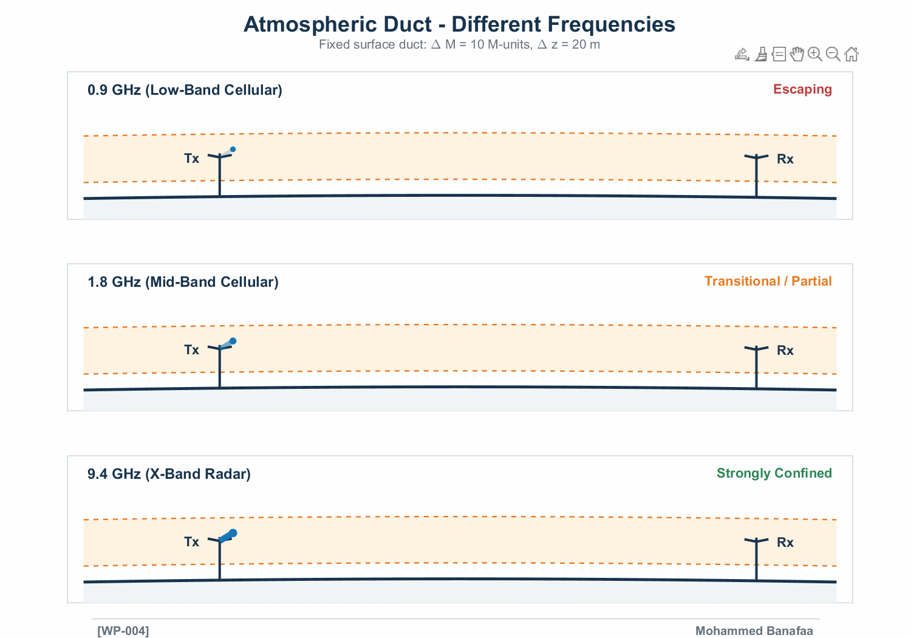

# [WP#004] Operating Frequency and Tropospheric Ducting
## Why the Same Duct Does Not Affect Every Signal Equally

**Wireless Propagation (WP)**

---

## Overview

In [WP#003], we characterized an atmospheric duct through three
important parameters:

- **Duct strength** (ΔM)
- **Duct thickness** (Δz)
- **Duct height** (z_h)

However, the existence of an atmospheric duct does not imply that
every radio frequency will be trapped equally.

The interaction between the electromagnetic wavelength and the
physical characteristics of the duct determines whether propagation
is weakly affected, partially confined, or more favorably trapped.

This post explores the relationship between **operating frequency,
duct thickness, and duct strength**.

---

## Physical Principle

For a simplified surface-based atmospheric duct, the maximum trapped
wavelength can be approximated by:

\[
\lambda_{\max} =
\frac{2}{3} C \Delta z \sqrt{\Delta M}
\]

and therefore:

\[
f_{\min} = \frac{c}{\lambda_{\max}}
\]

where:

- **Δz** = duct thickness (m)
- **ΔM** = duct strength (M-units)
- **C** = coefficient depending on the duct type
- **c** = speed of light (m/s)
- **λ_max** = approximate maximum trapped wavelength
- **f_min** = approximate minimum trapping frequency

For the simplified surface-based duct formulation, the relationship
can equivalently be expressed as:

\[
f_{\min} =
\frac{3c}
{2 C \Delta z \sqrt{\Delta M}}
\]

This relationship illustrates an important physical trend:

> **Thicker and stronger ducts can support longer wavelengths and,
> consequently, can influence lower operating frequencies.**

---

## Important Interpretation

The minimum trapping frequency should **not** be interpreted as an
ideal or perfectly sharp cutoff frequency.

Instead, it provides an approximate threshold describing the
frequency dependence of duct trapping.

- **Below the threshold:** stronger leakage is expected.
- **Near the threshold:** transitional or partial confinement may occur.
- **Above the threshold:** confinement becomes increasingly favorable,
  provided that the antenna and propagation geometry also support trapping.

Therefore, duct existence alone is insufficient to determine whether
a particular radio signal will be effectively trapped.

---

## Frequency Comparison

The visualization considers the same atmospheric duct and antenna
geometry while changing only the operating frequency.

For the illustrated **Δz = 20 m surface duct**, three representative
frequencies are compared:

| Frequency | Example Application | Expected Behaviour |
|---:|---|---|
| **0.9 GHz** | Low-band cellular | Below the approximate trapping threshold; stronger leakage is expected |
| **1.8 GHz** | Mid-band cellular | Near the transition region; partial confinement may occur |
| **9.4 GHz** | X-band marine radar | Well above the approximate threshold; confinement is more favorable |

The comparison demonstrates that the **same atmospheric structure can
produce substantially different propagation conditions at different
operating frequencies**.

---

## Visualization

### Frequency, Duct Strength, and Required Thickness

The first visualization quantifies the relationship between operating
frequency, duct strength, and the approximate minimum duct thickness
required for trapping.

As either **frequency** or **duct strength ΔM** increases, the approximate
minimum duct thickness required to support trapping decreases.

---

## Frequency-Dependent Propagation

The second visualization fixes the atmospheric duct and antenna geometry
and compares propagation at:

- 0.9 GHz
- 1.8 GHz
- 9.4 GHz

The animation illustrates the transition from stronger leakage at lower
frequencies toward more favorable confinement at higher frequencies.

---

## MATLAB Simulation

The MATLAB implementation used to generate the visualization is provided in:

`WP004_Frequency_Dependent_Ducting.m`

The simulation evaluates the relationship between:

- Operating frequency
- Electromagnetic wavelength
- Duct thickness
- Duct strength
- Approximate minimum trapping frequency

It then visualizes how the same atmospheric duct can interact differently
with signals operating at different frequencies.

> **Note:** The visualization is intended to illustrate the
> frequency-dependent trapping principle. It is not a full-wave solution
> of electromagnetic propagation inside the duct.

---

## LinkedIn Post

### [WP#004] Operating Frequency and Tropospheric Ducting:
### Why the Same Duct Does Not Affect Every Signal Equally

In **WP#003**, we characterized a duct by its strength (ΔM), thickness
(Δz), and height (z_h). But the existence of a duct does not mean that
every radio frequency will be trapped equally.

For a simplified surface-based duct, the maximum trapped wavelength can
be approximated by:

\[
\lambda_{\max} =
\frac{2}{3} C \Delta z \sqrt{\Delta M}
\]

\[
f_{\min} = \frac{c}{\lambda_{\max}}
\]

where C depends on the duct type and c is the speed of light.

This relationship shows that **thicker and stronger ducts can support
longer wavelengths and therefore influence lower operating frequencies.**

The minimum trapping frequency should not be interpreted as a perfect
physical cutoff. Below it, greater leakage is expected, while frequencies
close to the threshold may experience transitional or partial confinement.

The practical implication is that even under the same atmospheric duct,
different communication and radar bands can experience very different
propagation conditions.

For the illustrated **Δz = 20 m surface duct**:

1. **0.9 GHz — Low-band cellular:** below the approximate trapping
   threshold, with stronger leakage expected.

2. **1.8 GHz — Mid-band cellular:** close to the transition region,
   where partial confinement may occur.

3. **9.4 GHz — X-band marine radar:** well above the approximate
   threshold, making confinement more favorable for the same duct geometry.

The first figure quantifies this relationship, showing how the approximate
minimum duct thickness decreases as operating frequency or duct strength
(ΔM) increases.

The second figure fixes the duct and antenna geometry and compares the
three frequencies directly, illustrating the transition from stronger
leakage toward more favorable confinement.

**Next up:** Same duct, different frequencies, using the
**Parabolic Equation (PE)** to compute how the electromagnetic field
actually evolves across different bands.

---

## References

1. ITU-R P.834-9.

2. M. Banafaa and A. H. Muqaibel,
   "Tropospheric Ducting: A Comprehensive Review and Machine
   Learning-Based Classification Advancements,"
   *IEEE Access*, vol. 13, 2025.  
   DOI: 10.1109/ACCESS.2025.3537160

---

## Author

**Mohammed Banafaa**

Wireless Propagation (WP)